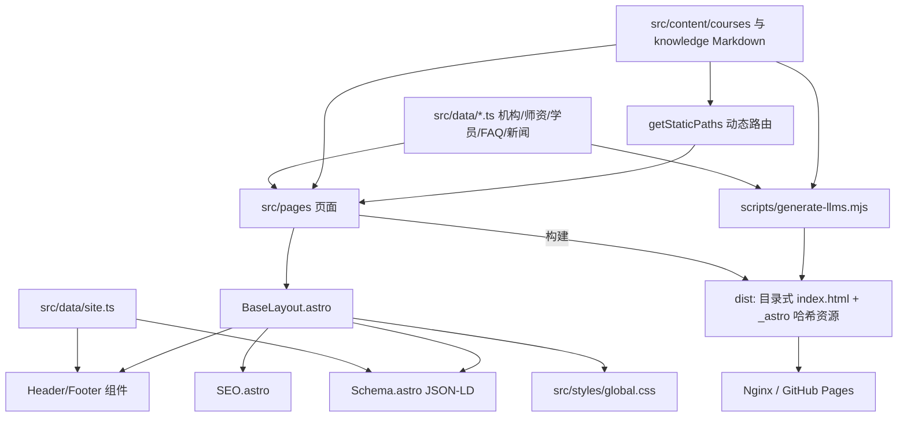

## 产品概述

将现有「美迪时代教育官网」手写静态站（40 余个手工 HTML + build.js 注入头尾）重构为 **Astro 7.x（当前最新稳定版 7.3.3）** 纯静态站点工程。重构后页面 URL、文案、视觉样式、SEO 元信息与结构化数据全部保持不变，但维护方式从「改 HTML」变为「改数据 + 改组件」，构建时自动生成 sitemap、robots、llms 等 SEO 资产。

## 核心特性

- **全站数据化**：8 门课程、师资、学员、FAQ、新闻、商业资讯、百科指南统一沉淀为内容源，页面由组件 + 数据渲染，新增/修改内容不再复制粘贴 HTML
- **布局与公共模块组件化**：顶部导航、页脚、回到顶部、CTA 区块等由 Astro 布局与组件承载，替代现有 `build.js` 标记注入机制
- **SEO 组件化**：统一 `SEO.astro`（title/description/keywords/canonical/OG/Twitter/favicon/manifest）与 `Schema.astro`（Organization/WebSite/WebPage + 页面级 ItemList、Course、FAQPage、BreadcrumbList），字段与现有 JSON-LD 完全对齐
- **构建产物自动化**：`@astrojs/sitemap` 生成 sitemap，脚本生成 `llms.txt` / `llms-full.txt`，CSS 由 Astro 自动压缩并带哈希，删除手工维护的 `style.min.css` 与版本号查询串
- **URL 与视觉零回归**：继续保持 `xxx/index.html` 目录式 clean URL；CSS 原样迁入全局样式，视觉逐页一致；历史 `.html` 地址保留兼容页兜底，线上仍由 Nginx 301 接管
- **交互不丢失**：FAQ 折叠、课程筛选、移动端菜单、导航高亮、数字滚动动画等从 `js/main.js` 拆到对应组件内按需加载

## 已确认约束

1. 纯静态 SSG，产出 `dist`，部署到现有 Nginx 或 GitHub Pages，不引入 SSR/adapter
2. 内容深度数据化（课程/师资/学员/FAQ/新闻/百科）
3. `css/style.css` 原样迁移为全局 CSS，删除 `style.min.css`
4. 仓库根目录直接改造，删除旧 HTML、`build.js`、`css/`、`js/`，保留图片等资源
5. 使用 Astro 最新版（v7.3.3）

## 技术栈选型（已按 v7 校准）

- **框架**：Astro `^7.3.3`（npm latest 实测 7.3.3）+ TypeScript（strict，仅类型标注，不引入运行时依赖）
- 环境要求：`Node >= 22.12.0`、`npm >= 9.6.5`（本地 Node v24.12.0 已满足）
- v7 内置 Vite 8 与 Rust 编译器，无需额外配置
- **内容**：Astro Content Collections（Content Layer API，`src/content.config.ts` + `glob()` loader，v7 沿用该 API）—— 长文（8 门课程详情、3 篇百科指南）用 Markdown + Zod frontmatter 校验；结构化短内容（师资、学员、FAQ、新闻、商业资讯）用类型化 TS 数据模块（`src/data/*.ts`）
- **SEO**：`@astrojs/sitemap` `^3.7.4`（官方集成，devDependency 已对齐 Astro 7.x）；`robots.txt` 静态置于 `public/`；`llms.txt`/`llms-full.txt` 由构建后脚本从同一份数据生成
- **样式**：原 `css/style.css`（68KB，含 `:root` 变量、主色 `#0066FF`/`#E60012`、响应式断点）整份迁入 `src/styles/global.css`，由 Astro 自动压缩加哈希；不引入 Tailwind、不重写样式
- **脚本**：组件内 `<script>`（Astro 默认打包+压缩+按需加载），不再有全站单一 `main.js`
- **部署**：`output: 'static'`、`build.format: 'directory'`、`trailingSlash: 'always'`，产物目录态与现网一致

## Astro v7 专属适配要点（必读，直接影响实现方式）

依据官方 Upgrade to Astro v7 文档，以下变更与本次重构相关：

1. **Rust 编译器成为默认且唯一编译器，对非法 HTML 更严格**

- 未闭合标签直接报错（旧站手写 HTML 若存在 `<p>`、`<div>`、组件标签未闭合，迁移时需补齐）
- 不再自动纠正非法嵌套（如 `<p>` 内嵌 `<div>`），原样输出交给浏览器 —— 旧站若有此类结构，需在迁移时改成合法容器，否则布局会跑偏

2. **`compressHTML` 默认值由 `true` 变为 `'jsx'`**：行内元素之间的空白会被按 JSX 规则吃掉（`<span>hello</span><em>world</em>` 渲染为 `helloworld`）。由于本站点大量中文文案与行内元素混排，建议在 `astro.config.mjs` 显式设置 `compressHTML: true` 保持 v6 行为，避免中文排版出现缺空格
3. **Markdown 默认处理器改为 Sätteri**：本项目不使用 remark/rehype 插件，无需安装 `@astrojs/markdown-remark`，保持默认即可（GFM + SmartyPants 行为一致）
4. **Vite 8**：不引入自定义 Vite 插件，无影响
5. **`src/fetch.ts` 为保留文件名**：本项目不会用到，组件与数据命名避开该名字即可
6. **zod 4.x** 已由 Astro 内置（`astro/zod` 导出），content config 中直接 `import { z } from 'astro:content'` 使用，无需单独安装

## 实现方案

整体策略是「先建骨架与数据层，再逐页迁移，最后自动产物 + 清理旧文件」，全程保持 URL 不变，可用旧站做逐页对照。

1. **工程初始化**：`npm init` 后安装 `astro@^7.3.3`、`@astrojs/sitemap@^3.7.4`；根目录新建 `astro.config.mjs`（`site: 'https://www.chinamede.com'`、`output: 'static'`、`build.format: 'directory'`、`trailingSlash: 'always'`、`compressHTML: true`、`integrations: [sitemap()]`）、`tsconfig.json`（继承 `astro/tsconfigs/strict`）、`.gitignore`（`node_modules/`、`dist/`、`.astro/`）。动手前先打备份 tag（如 `legacy-before-astro`）以便随时对照/回滚。
2. **资源归位**：`images/`、favicon 系列、`site.webmanifest`、`CNAME`、`robots.txt` 移入 `public/`（保持 URL 完全不变，避免图片搜索索引丢失）；历史 16 个 `.html` 兼容页原样复制到 `public/` 作为无 Nginx 规则环境（如 GitHub Pages）的兜底。
3. **数据层**：`src/data/site.ts` 沉淀机构信息（公司名、2011 创立、6 城 13 校区、400-800-4459、地址、备案号 粤ICP备15034320号-7、导航树），供 Header/Footer/Schema 共用；其余按 `teachers.ts`、`students.ts`、`faqs.ts`、`news.ts`、`business.ts` 组织。课程与百科用 Markdown collection。
4. **布局与组件层**：`BaseLayout.astro` 负责 `<head>`（SEO + Schema + 样式）与 `<body>`（Header + slot + Footer + BackToTop）；`404.astro` 沿用其精简版头尾（导航更少、无电话区），因此 `Header.astro` 需支持 `variant="simple"`。所有模板按 Rust 编译器要求写成闭合完整、嵌套合法的标签。
5. **页面层**：频道页为 `src/pages/xxx/index.astro`；8 门课程详情由 `src/pages/courses/[slug].astro` 配 `getStaticPaths()` 生成；3 篇百科由 `src/pages/knowledge/[slug].astro` 生成。
6. **产物自动化**：sitemap 用官方集成；`scripts/generate-llms.mjs` 在 `astro build` 之后读取同一份内容数据，生成 `dist/llms.txt` 与 `dist/llms-full.txt`（结构与现有文件保持一致）；`package.json` 中 `build` 串接两步。
7. **验收与清理**：`npm run build` 后用静态服务器起 `dist`，与备份 tag 的旧站逐页比对 URL 清单、title/description/canonical、JSON-LD 字段、中文文本空格与视觉截图；通过后删除旧 HTML、`build.js`、`css/`、`js/` 与 `partials/`。

## 架构设计



## 实施要点（避免回归）

- **CSS 只搬不改**：整份复制，不动选择器；组件内的 `class` 名必须与现有 HTML 完全一致，否则视觉立刻跑偏。
- **Astro 7 编译校验**：每个页面写完后立刻 `npm run build`，按 Rust 编译器报错补齐闭合标签、修正非法嵌套，不要攒到最后一次性修。
- **空白与中文排版**：`compressHTML: true` 写进配置；中文与行内元素相邻处手动加 `{' '}`，对照旧站检查是否有空格丢失。
- **图片先不动**：统一放 `public/`，保留原路径与 `width/height/loading/decoding` 属性，避免 CLS 与图片索引回归；`src/assets` + `<Image>` 优化列为后续可选项。
- **JSON-LD 逐字段对齐**：现有 `partials/schema.html` 的 `@id` 前缀 `https://www.chinamede.com/#organization`、`#website`、`#webpage` 必须沿用；首页 `ItemList` 8 条热门课程、`WebPage` 的 `publisher`/`about` 引用不能丢。
- **脚本按需加载**：拆散后只有用到该组件的页面才加载对应脚本，避免每个页面都背 11KB；`data-count` 数字动画、`.filter-btn` 筛选、FAQ 折叠逐一落位并用浏览器验证。
- **重定向兜底**：静态托管无 301 能力，线上继续用 `deploy/nginx-redirects.conf` 的 16 条规则；`public/` 里的兼容页作为 GitHub Pages 场景的兜底，不计入 sitemap。
- **控制改动半径**：不引入 UI 框架、不重写样式、不改 URL，一次只迁移一个频道页并即时对照。

## 目录结构

```
meidi-website/
├── package.json                 # [NEW] 依赖(astro ^7.3.3、@astrojs/sitemap ^3.7.4)与 dev/build/preview 脚本；build 串接 llms 生成
├── astro.config.mjs             # [NEW] site=https://www.chinamede.com，output static，format directory，trailingSlash always，compressHTML true，集成 sitemap
├── tsconfig.json                # [NEW] 继承 astro/tsconfigs/strict
├── .gitignore                   # [NEW] node_modules/、dist/、.astro/（仓库当前缺失，必须补）
├── scripts/
│   └── generate-llms.mjs        # [NEW] 构建后从内容数据生成 dist/llms.txt 与 dist/llms-full.txt
├── src/
│   ├── content.config.ts        # [NEW] 定义 courses、knowledge 两个 collection 及 Zod schema（用 astro:content 的 z）
│   ├── content/
│   │   ├── courses/             # [NEW] n1-ai-newmedia.md … n8-overseas-smm.md（8 门课程长正文 + frontmatter）
│   │   └── knowledge/           # [NEW] guide-geo.md、guide-newmedia.md、guide-shortvideo.md
│   ├── data/
│   │   ├── site.ts              # [NEW] 机构信息/导航/电话/备案号/校区，Header、Footer、Schema 共用
│   │   ├── teachers.ts          # [NEW] 师资数据（8 位）
│   │   ├── students.ts          # [NEW] 学员案例数据
│   │   ├── faqs.ts              # [NEW] FAQ 问答数据（12 条，含分类）
│   │   ├── news.ts              # [NEW] 机构动态数据（9 条）
│   │   └── business.ts          # [NEW] 商业资讯数据（9 条）
│   ├── styles/
│   │   └── global.css           # [NEW] 由 css/style.css 原样迁入，零修改
│   ├── layouts/
│   │   └── BaseLayout.astro     # [NEW] head(SEO/Schema/样式)+body(Header/slot/Footer/BackToTop)，支持 variant 供 404 用
│   ├── components/
│   │   ├── Header.astro         # [NEW] 由 partials/header.html 迁移，含移动端菜单脚本与导航高亮
│   │   ├── Footer.astro         # [NEW] 由 partials/footer.html 迁移，含备案号与链接组
│   │   ├── SEO.astro            # [NEW] title/description/keywords/robots/canonical/favicon/manifest/OG/Twitter
│   │   ├── Schema.astro         # [NEW] 站点级 Organization+WebSite，页面级 WebPage/ItemList/Course/FAQPage/BreadcrumbList
│   │   ├── CourseCard.astro     # [NEW] 课程列表卡片（封面图 + 标题可跳转详情）
│   │   ├── CourseDetailCard.astro # [NEW] 课程详情主卡片（封面、标签、价格、课时、三阶段大纲、CTA）
│   │   ├── CourseFilter.astro   # [NEW] 课程分类筛选按钮 + 筛选脚本
│   │   ├── FaqAccordion.astro   # [NEW] FAQ 折叠面板 + 折叠脚本
│   │   ├── StatsBar.astro       # [NEW] data-count 数字滚动动画区块
│   │   ├── CtaSection.astro     # [NEW] 页面底部招生 CTA 区块
│   │   └── BackToTop.astro      # [NEW] 回到顶部按钮 + 滚动脚本
│   └── pages/
│       ├── index.astro          # [NEW] 首页（含热门课程 ItemList JSON-LD）
│       ├── 404.astro            # [NEW] 404 页，沿用精简版头尾
│       ├── brand/index.astro    # [NEW] 品牌介绍
│       ├── courses/index.astro  # [NEW] 课程列表（109KB 原页由 8 条数据 + 组件渲染）
│       ├── courses/[slug].astro # [NEW] 8 门课程详情动态路由
│       ├── teachers/index.astro # [NEW] 师资团队
│       ├── students/index.astro # [NEW] 学员风采
│       ├── knowledge/index.astro    # [NEW] 知识百科首页
│       ├── knowledge/[slug].astro   # [NEW] 3 篇指南动态路由
│       ├── faq/index.astro      # [NEW] 美迪问答
│       ├── news/index.astro     # [NEW] 机构动态
│       ├── business/index.astro # [NEW] 商业资讯
│       ├── industry/index.astro # [NEW] 产教融合
│       ├── enroll/index.astro   # [NEW] 免费试听（引导式，无表单）
│       └── contact/index.astro  # [NEW] 联系我们
├── public/
│   ├── images/                  # [MOVE] 48 个图片原样迁移，路径不变
│   ├── favicon*、apple-touch-icon*、android-chrome*、site.webmanifest、CNAME  # [MOVE] 原样迁移
│   ├── robots.txt               # [MOVE] 内容沿用，Sitemap 行指向 https://www.chinamede.com/sitemap-index.xml
│   └── *.html（16 个历史兼容页）# [MOVE] 原样保留作为重定向兜底
└── 删除项                        # [DELETE] 旧根目录 HTML、各目录旧 index.html、build.js、css/、js/、partials/（验收通过后执行）
```

## 关键数据结构

```ts
// src/content.config.ts —— 课程长文 collection 的 frontmatter 契约（Zod 校验，v7 仍用 Content Layer API）
import { defineCollection, z } from 'astro:content';
import { glob } from 'astro/loaders';

const courses = defineCollection({
  loader: glob({ pattern: '*.md', base: './src/content/courses' }),
  schema: z.object({
    slug: z.string(),              // n1-ai-newmedia，决定 URL
    code: z.string(),              // N1
    title: z.string(),             // AI新媒体运营师就业班
    category: z.string(),          // ai | visual | video | aigc | ecommerce | overseas
    isFeatured: z.boolean().default(false),
    cover: z.string(),             // /images/courses/xmtyysjyb.webp
    coverAlt: z.string(),
    tags: z.array(z.string()),     // AI长期班 / 22天带薪实习 / …
    price: z.object({ current: z.string(), origin: z.string(), save: z.string() }),
    facts: z.array(z.string()),    // 50天线下集训+22天实习、288课时…
    curriculum: z.array(z.object({ stage: z.string(), title: z.string(), points: z.array(z.string()) })),
    faq: z.array(z.object({ q: z.string(), a: z.string() })),
    order: z.number(),
  }),
});
```

```ts
// src/data/site.ts —— 全站共用机构信息（Header/Footer/SEO/Schema 单一数据源）
export interface SiteConfig {
  name: string;            // 美迪时代教育
  legalName: string;       // 广州美迪教育科技有限公司
  slogan: string;          // 让职业就业更简单
  url: string;             // https://www.chinamede.com
  telephone: string;       // 400-800-4459
  foundedYear: string;     // 2011
  cities: string[];        // 广州/深圳/佛山/东莞/中山/江门
  campusCount: string;     // 13 个直营校区
  address: string;         // 广州市越秀区三元里大道217号民生商业大厦3—4楼
  icp: string;             // 粤ICP备15034320号-7
  ogImage: string;         // /images/og-cover.png
  nav: Array<{ label: string; href: string }>;
}
```

## Agent Extensions

### Skill

- **geo-schema**：重构后逐页校验 JSON-LD，确保 Organization/WebSite/WebPage、首页 ItemList、课程页 Course、FAQPage 与 BreadcrumbList 字段无缺失、无失效引用
- **geo-llmstxt**：校验新生成的 `llms.txt` / `llms-full.txt` 与现有版本差异，指导 `scripts/generate-llms.mjs` 的输出结构
- **agent-browser**：本地起 `dist` 后批量截图，与备份 tag 的旧站逐页做视觉与 DOM 结构对照（重点查中文空格与卡片间距）

### SubAgent

- **code-explorer**：迁移过程中批量核对旧 HTML 的 class 名、文案与 JSON-LD 片段，避免遗漏