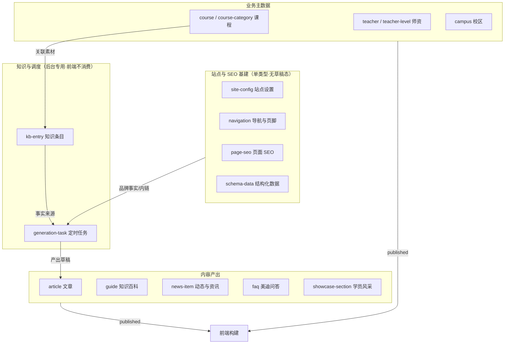
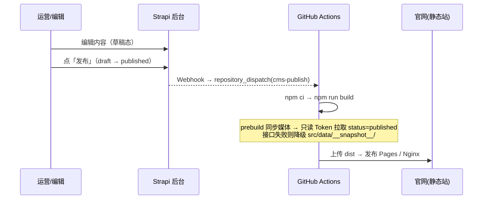
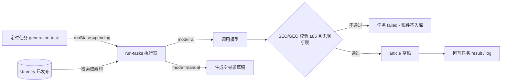
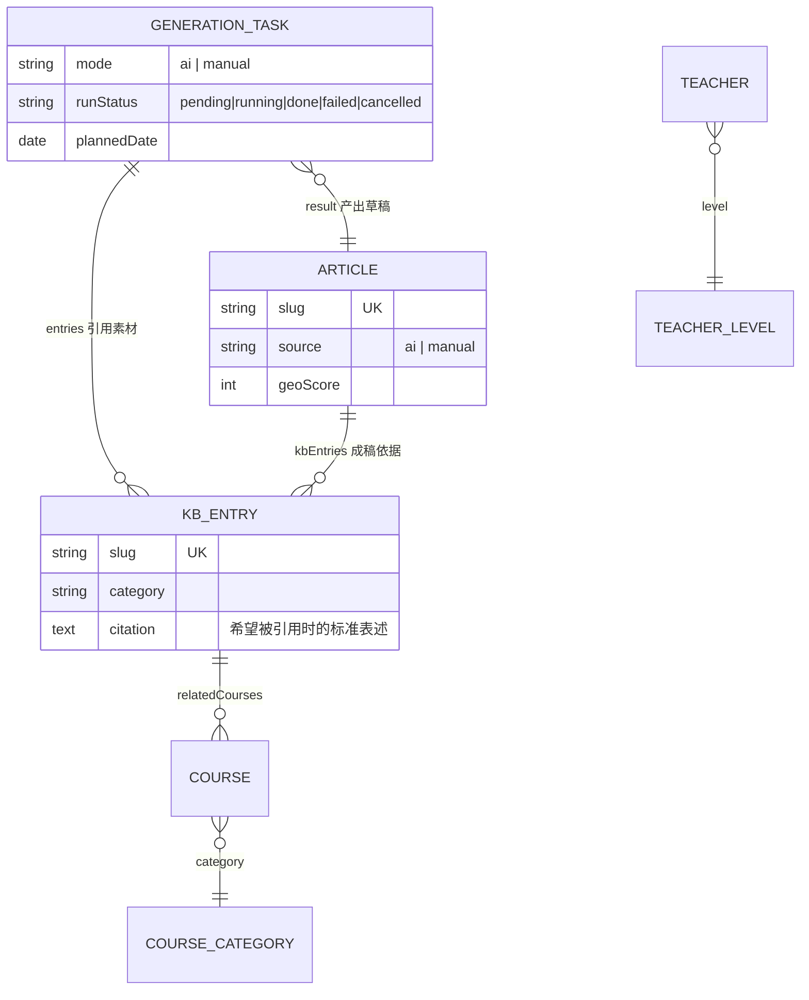

# 内容发布体系地图

> 本文梳理美迪官网 CMS（`cms/`）中所有涉及内容发布的模块：内容类型、发布流程、权限控制与模块间关联关系。
> 与 `docs/strapi-cms-design.md`（系统设计）互为补充：那份讲「为什么这么设计」，这份讲「现在有哪些东西、各自怎么上线」。

---

## 1. 模块分层总览



---

## 2. 内容类型清单（16 个）

### 2.1 集合类型（12 个）

| 后台名称 | API 标识 | 发布态 | 关键字段 | 前端消费位置 |
|---|---|---|---|---|
| 文章 | `article` | draft/publish | `slug`(唯一)、`summary`、`content`(HTML)、`cover`、`tags`、`author`、`source`(ai/manual)、`targetKeywords`、`seo`、`answerBlocks`、`keyFacts`、`faq`、`sources`、`relatedLinks`、`geoScore` | `/articles/`、`/articles/[slug]`、`/articles/page/[n]`、`llms.txt` |
| 知识百科 | `guide` | draft/publish | `slug`(唯一)、`title`、`subtitle`、`emoji`、`categoryLabel`、`summary`、`content`(HTML)、`seo`、`order` | `/knowledge/`、`/knowledge/[slug]`、`llms.txt` |
| 动态与资讯 | `news-item` | draft/publish | `title`、`channel`(news→`/news/`；business→`/business/`)、`dateText`、`emoji`、`summary`、`order` | `/news/`、`/business/` |
| 美迪问答 | `faq` | draft/publish | `faqId`(唯一)、`question`、`answer`、`defaultOpen`、`order` | `/faq/`、`llms.txt` |
| 学员风采 | `showcase-section` | draft/publish | `sectionId`(唯一)、`title`、`subtitle`、`items`(`shared.showcase-item[]`) | `/students/` |
| 课程 | `course` | draft/publish | `code`（**无 slug 字段**，前端用 `code` 兜底路由）、`mainTitle`、`badge`、`tags`、`cover`、`metaTags`、`price`、`stats`、`curriculum`(`course.stage`→`course.module`)、`practice`、`outcomes`、`faq`、`seo` | `/courses/`、`/courses/[slug]`、`llms.txt` |
| 课程分类 | `course-category` | draft/publish | `code`(唯一)、`name`、`description`、`order` | 课程分组/筛选 |
| 师资 | `teacher` | draft/publish | `name`、`title`、`desc`、`avatar`、`photo`(媒体)、`level`(→teacher-level) | `/teachers/` |
| 师资层级 | `teacher-level` | draft/publish | `levelCode`(唯一)、`name`、`gradient`、`desc`、`meta`、`order` | `/teachers/`（分组） |
| 校区 | `campus` | draft/publish | `campusId`(唯一)、`displayTitle`、`cityCode`、地址三件套、`traffic`、`cover` + `coverPath` | `/`、`/contact/`、JSON-LD |
| 知识条目 | `kb-entry` | draft/publish | `slug`(唯一)、`aliases[]`、`category`、`topic`、`points`、`facts`、`qa`、`citation`、`sources`、`tags`、`attachments`(归档)、`credibility`、`lastVerified` | **不消费**（AI 事实源） |
| 定时任务 | `generation-task` | **无发布态** | `title`、`mode`(ai/manual)、`entries`(→kb-entry)、`topic`、`wordCount`、`audience`、`tone`、`targetKeywords`、`plannedDate`、`runStatus`、`retries`、`result`(→article)、`log`、`requestedBy` | **不消费** |

### 2.2 单类型（4 个，均无草稿态）

| 后台名称 | API 标识 | 作用 |
|---|---|---|
| 站点设置 | `site-config` | `baseUrl`（canonical / OG / JSON-LD / llms.txt 统一基准）、`legalName`、`knowsAbout[]`、`sameAs[]`（实体同一性）、`llmsIntro` / `llmsFacts[]` / `llmsCitation`、logo / ogImage / 二维码 + 各自 `*Path` 静态回退 |
| 导航与页脚 | `navigation` | `nav`(`shared.link[]`)、`footerGroups`、`footerIntro`、`footerContacts[]`、`footerBottom[]` |
| 页面 SEO | `page-seo` | `entries`(`shared.route-seo[]`)：按路由（`/teachers/` 等）维护元信息，缺失时回退 site-config |
| 结构化数据 | `schema-data` | `siteNodes`（Organization / WebSite）、`pageNodes`（路由为键的页面级 JSON-LD 字典） |

### 2.3 组件（20 个，`cms/src/components`）

- `kb.*`：`point`（要点）、`fact`（数据点：label/value/year/source）、`source`（来源出处）
- `geo.*`：`answer-block`（答案段落：问题 + 2–4 句直给结论）、`key-fact`（关键数据）、`source`（引用来源）——挂在 article 上，决定 AI 可引用性
- `shared.*`：`seo`、`route-seo`、`cover`、`meta-tag`、`faq-item`、`link`、`footer-group`、`showcase-item`、`stat-item`
- `course.*`：`stage`、`module`、`price`、`practice`、`outcomes`

---

## 3. 发布流程

### 3.1 人工发布链路



关键约束：

- 前端只取 `status=published`（`src/lib/strapi.ts`、`scripts/export-snapshot.mjs` 统一拼参），**草稿永不上线**
- AI 内容工厂产出的文章一律是 `draft`，**必须人工发布后才上线**
- 取数清单唯一来源 `src/lib/strapi-sources.json`（14 项），`strapi.ts` 与快照脚本共用，避免漂移

### 3.2 AI 出稿链路（现有）



- 执行器入口：`cms/src/lib/ai/cli.ts`（`run` / `once` / `preview` / `check`）
- 主流程：`cms/src/lib/ai/run-tasks.ts`；校验：`validate.ts`（100 分制，通过线 85）
- 限额与窗口：`AI_DAILY_LIMIT`（默认 3）、`AI_RUN_WINDOW`（如 `09:00-21:00`）
- 调度方式（现状）：外部 crontab / Windows 计划任务 / GitHub Actions 定时调用 CLI

### 3.3 构建发布

| 阶段 | 命令/脚本 | 说明 |
|---|---|---|
| 媒体同步 | `npm run cms:sync-media`（`scripts/sync-media.mjs`） | 构建前把课程/校区封面、讲师照、logo 等下载到 `public/images/`；按「文件存在 + 远程大小一致」跳过 |
| 快照 | `npm run cms:snapshot`（`scripts/export-snapshot.mjs`） | 导出已发布内容到 `src/data/__snapshot__/`，用于降级与审计 |
| 构建 | `npm run build` | `prebuild` → `astro build`（纯静态 SSG，25 页） |
| 部署 | `.github/workflows/deploy.yml` | 触发源：push main / `workflow_dispatch` / `repository_dispatch: cms-publish` |

---

## 4. 权限控制

| 层面 | 现状 |
|---|---|
| 后台用户 | Strapi 原生角色（Super Admin / Editor / Author），**项目内无自定义 RBAC 代码** |
| 公开读（Content API） | `cms/src/index.ts` 在启动时给 `public` 角色自动授予 22 项 `find` / `findOne`（覆盖 12 个集合 + 4 个单类型），保证本地无 Token 也能构建 |
| API Token | `STRAPI_READONLY_TOKEN`（read-only：官网构建 / 快照 / 媒体同步）、`STRAPI_WRITE_TOKEN`（full-access：AI 写草稿与回写任务状态）；由 `cms/scripts/init-tokens.ts` 创建 |
| CORS | `cms/config/middlewares.ts`：`origin: '*'` 并显式放行 `Authorization` 头（构建机来源不固定、不用 Cookie） |
| 媒体 | 已关闭上传体积优化（避免二维码被重压缩、避免媒体同步「大小比对」永远不相等） |
| 后台界面扩展 | `cms/src/admin/app.ts` 仅做中文补齐与两处 DOM 微调，**无自定义页面 / 插件注册** |

> 注意：`cms/.env.example` 里的 `DEPLOY_WEBHOOK_URL` / `DEPLOY_WEBHOOK_TOKEN` 目前代码中无引用，发布触发依赖 GitHub `repository_dispatch` + 后台手工配置 Webhook。

---

## 5. 模块间关联关系



前端不消费 `kb-entry` 与 `generation-task`（二者不在 `strapi-sources.json` 清单内），属于纯后台/AI 侧资产。

---

## 6. 本次改造：三种生成方式 + 内嵌 RAG

### 6.1 三种生成方式

定时任务新增 `trigger` 字段，与原有 `mode`（ai 成稿 / manual 人工撰写骨架）组合使用：

| 触发方式 | 字段值 | 后台怎么用 | 由谁执行 | 适合场景 |
|---|---|---|---|---|
| **手动生成** | `now` | 打开任务详情 → 点右上角「立即生成」；或把触发方式选成「手动生成」保存 | 点按钮时后端立即调起（`/api/content-factory/tasks/:id/run`，202 异步返回）；改字段时由调度器在下一次巡检（≤60 秒）拾起 | 临时补一篇、改完提示词想立刻看效果 |
| **自动生成** | `queue`（默认） | 建好任务不管它 | 调度器每隔 `SCHEDULER_QUEUE_INTERVAL_HOURS`（默认 20 小时）批量消费一次，受 `AI_DAILY_LIMIT` 约束 | 选题池排队，按节奏出稿 |
| **定时自动生成** | `schedule` | 填 cron 表达式与时区（如 `0 10 * * 1` = 每周一 10:00） | 调度器按 `nextRunAt` 到点执行，执行后自动排下一次 | 固定栏目更新（每周行业观察等） |

配套字段：`scheduleCron`、`timezone`、`enabled`（停用开关）、`nextRunAt` / `lastRunAt`（调度器回写，后台只读）。

校验规则（写在 `lifecycles.ts`）：`trigger=schedule` 时 cron 与时区必须合法，否则保存时直接给出可读提示（HTTP 400），不会静默地「永不执行」。cron 支持标准 5 段与 `*`、`*/n`、`a-b`、`a,b` 语法，时区按 IANA 名称（如 `Asia/Shanghai`）。

内嵌调度器在 `cms/src/index.ts` 的 `bootstrap` 启动，**零新增 npm 包**（自写 cron 解析 + 分钟级 tick），可用 `SCHEDULER_ENABLED=false` 关闭，退回原来的 crontab / GitHub Actions 方式。

### 6.2 内嵌 RAG 知识库

```
kb-entry（后台结构化录入）
   │ 切片：概览 / 要点 / 关键数据 / 逐条问答
   ▼
云 embedding（OpenAI 兼容 /embeddings，通义·智谱·OpenAI 任选）
   ▼
SQLite 向量表 cms/.tmp/kb-vectors.db（better-sqlite3，已在依赖里）
   ▼
HybridKbRetriever：向量 0.7 + 关键词 0.3 融合排序
   ▼
AI 内容工厂取素材 → 出稿 → 人工发布
```

- **素材来源**：只走后台结构化录入（`kb-entry`）；`attachments` 字段保留为原始资料归档，不做解析
- **索引时机**：后台保存/发布知识条目时自动索引该条；首次接入或换模型后执行 `npm run cms:kb:index` 全量重建
- **降级策略**：向量库没建、密钥没配、外部知识库超时，都会自动退回关键词检索，只打一条 warn，**不会让生成流程中断**
- **切换方式**：`KB_RETRIEVER=keyword | hybrid | vector | remote`
- **外部知识库**（如 ima）：实现为 `RemoteKbRetriever`，约定 POST `{ query, keywords, limit }`，配置 `EXTERNAL_KB_ENDPOINT` 后即可用；未配置自动降级

### 6.3 新增命令

| 命令 | 作用 |
|---|---|
| `npm run cms:kb:index` | 全量重建知识库索引 |
| `npm run cms:kb:status` | 查看检索模式、分片数、embedding 配置 |
| `npm run cms:kb:clear` | 清空向量库 |
| `npm run cms:ai:preview -- --topic "选题"` | 不调模型，只预览提示词与命中的素材 |
| `npm run cms:ai:run:once -- --task <documentId>` | 命令行手动执行单篇（与后台按钮等价） |

### 6.4 决策记录

- RAG 采用**内嵌自建**，不引入 Docker 与独立向量服务；embedding 走云 API
- 知识库素材**仅结构化录入**，不新增 PDF/DOCX 解析依赖（附件保持归档）
- 调度器**零新增 npm 包**
- 人工发布链路不变：AI 只写 `draft`，必须人工点发布才上线
