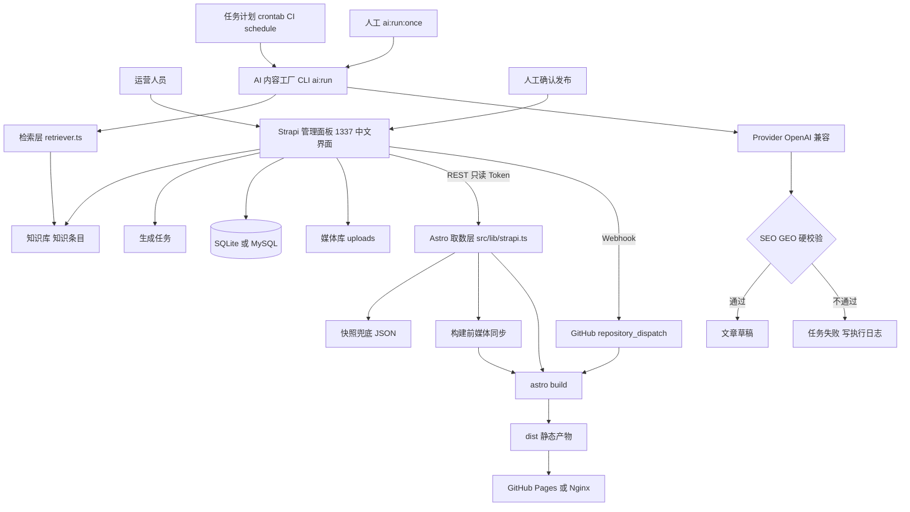

# 美迪时代教育 · Strapi 内容后台设计说明

本文取代已删除的《自研后台设计文档》。后台由开源 **Strapi 5**（MIT）承载，官网（Astro 静态站）
在**构建期**通过只读 REST Token 拉取内容生成静态产物。后台同时承担两件新事情：
**知识库**（文章生成的事实基准）与 **AI 内容工厂**（按选题产出文章草稿，不自动上线）。

配套文档：`cms/README.md`（运维手册：启动、账号、中文界面、AI 配置、定时任务、备份、故障排查）。

---

## 1. 目标与边界

| 目标 | 落地方式 |
| --- | --- |
| 运营可自助改内容 | 12 个集合类型 + 4 个单类型 + 20 个共用组件，字段显示名与提示全中文 |
| 官网内容可维护且构建可复现 | 构建期取数 + 只读 Token；后台不可达时降级读快照 `src/data/__snapshot__/*.json` |
| 新增内容形态 | 文章（`/articles/`）列表页 + 详情页，带 JSON-LD、相关阅读内链与 llms.txt 收录 |
| 借助知识库生成文章 | 结构化「知识条目」+ 关键词检索层 + 统一 AI Provider + SEO/GEO 硬校验 |
| 定时与手动两条路径 | 任务计划 / crontab / GitHub Actions 三条调度入口，共用同一个 CLI |
| 改号不改代码 | 热线、客服手机与微信号、微信二维码、备案号等全部来自「站点设置」 |

**明确不做**（本轮边界）：

- 不做向量检索（RAG）——检索层已抽象，加实现即可替换，见 §5.3；
- 不装 i18n 插件（站点只有中文内容，界面语言与内容多语言是两件事）；
- AI 生成结果**不自动发布**，一律先落草稿、人工校对后发布；
- 首页/品牌介绍/产教融合页的营销长文案仍写在 `.astro` 中，只把可列表化内容与
  导航、页脚、SEO、联系方式接入后台。

---

## 2. 架构与数据流



关键点：

- **后台与官网完全解耦**：官网只读、只认 REST；后台重启不影响已生成的 `dist`。
- **生成与发布解耦**：AI 只写草稿 → 人工发布 → Webhook 触发重建，半成品不会上线。
- **单点通信入口**：官网所有请求都走 `src/lib/strapi.ts`，页面层不出现 `fetch`。

---

## 3. 内容建模

### 3.1 集合类型（12）

| UID | 中文名 | 承载的旧数据 | 关键字段 |
| --- | --- | --- | --- |
| `api::course.course` | 课程 | `courses.ts` | `slug`、`code`、`title/subtitle/mainTitle`、`category`(→课程分类)、`cover`、`badge`、`metaTags`、`price`、`stats`、`descHighlight`、`curriculum`(阶段→模块)、`practice`、`outcomes`、`tags`、`faq`、`seo`、`order` |
| `api::course-category.course-category` | 课程分类 | `courses.ts` 的分类 | `code`、`name`、`description`、`order` |
| `api::teacher.teacher` | 师资 | `teachers.ts` | `name`、`title`、`avatar`、`desc`、`levelCode`(→师资层级 code)、`order` |
| `api::teacher-level.teacher-level` | 师资层级 | `teacherLevels.ts` | `code`、`name`、`gradient`、`desc`、`meta`、`order` |
| `api::campus.campus` | 校区 | `campuses.ts` | `campusId`、`name`、`displayTitle`、`cityCode`、`telephone`、`streetAddress/locality/region/city`、`traffic`、`trafficDisplay`、`cover`+`coverPath`+`coverAlt`、`order` |
| `api::news-item.news-item` | 动态与资讯 | `news.ts`、`business.ts` | `title`、`channel`(机构动态/商业资讯)、`dateText`、`emoji`、`summary`、`order` |
| `api::guide.guide` | 知识百科 | `guides.ts` + `content/knowledge/*.html` | `slug`、`title/subtitle`、`emoji`、`categoryLabel`、`summary`、`content`(HTML)、`seo`、`order` |
| `api::faq.faq` | 美迪问答 | `faqs.ts` | `faqId`、`question`、`answer`、`defaultOpen`、`order` |
| `api::showcase-section.showcase-section` | 展示区块 | `students.ts` | `sectionId`、`title/subtitle`、`items[]`(emoji/title/desc)、`order` |
| `api::article.article` | 文章 | 新增（AI/人工） | `title`、`slug`、`summary`、`content`(HTML)、`cover`、`tags`、`author`、`source`(ai/manual)、`targetKeywords`、`seo`、`answerBlocks[]`、`keyFacts[]`、`faq[]`、`sources[]`、`relatedLinks[]`、`kbEntries[]`、`geoScore` |
| `api::kb-entry.kb-entry` | 知识条目 | 新增（知识库） | `title`、`slug`、`aliases`、`category`、`topic`、`points[]`、`facts[]`、`qa[]`、`citation`、`sources[]`、`relatedCourses[]`、`tags`、`attachments`、`credibility`、`lastVerified` |
| `api::generation-task.generation-task` | 生成任务 | 新增（内容工厂） | `title`、`mode`(ai/manual)、`entries[]`(→知识条目)、`topic`、`wordCount`、`audience`、`tone`、`targetKeywords`、`plannedDate`、`runStatus`、`retries`、`result`(→文章)、`log`、`requestedBy` |

> 没有单独的「学员案例」类型：学员风采由**展示区块** + 展示条目组件承载（就业学员 / 学生活动 / 学生作品）。
> 生成任务**一次执行产出一篇草稿**，批量靠多条任务 + `--limit` / `AI_DAILY_LIMIT` 控制。

### 3.2 单类型（4）

| UID | 中文名 | 关键字段 |
| --- | --- | --- |
| `api::site-config.site-config` | 站点设置 | `name`、`legalName`(机构全称)、`slogan`、`baseUrl`(站点基准地址)、`telephone`+`telephoneHref`、`serviceHours`、`foundedYear`、`cities`、`campusCount`、`campusDisplay`、`address`、`icp`+`icpUrl`、`logo`+`logoPath`+`logoAlt`、`ogImage`+`ogImagePath/Width/Height`、`description`、`generator`、`author`、`copyright`、`knowsAbout`、`wechatQr`+`wechatQrPath`+`wechatQrAlt`、`wechatPhone`+`wechatPhoneLabel`、`wechatScanTip`、`llmsIntro`、`llmsFacts`、`llmsCitation` |
| `api::navigation.navigation` | 导航与页脚 | `nav[]`(链接)、`footerGroups[]`(分组→链接)、`footerIntro`、`footerContacts[]`、`footerBottom[]` |
| `api::page-seo.page-seo` | 页面 SEO | `entries[]`(路由 → SEO 组件：title/description/keywords/canonical) |
| `api::schema-data.schema-data` | 结构化数据 | `siteNodes`(JSON 数组)、`pageNodes`(JSON 对象：路由 → 节点数组) |

### 3.3 共用组件（20）

| 分组 | 组件 | 字段 |
| --- | --- | --- |
| `shared` | 封面 | `image`(媒体)、`fallbackPath`、`alt`、`width`、`height` |
| | SEO 元信息 | `title`、`description`、`keywords`、`canonical` |
| | 链接 | `label`、`href`、`external` |
| | 问答项 | `question`、`answer` |
| | 页脚分组 | `title`、`links[]` |
| | 标签 | `text`、`cls` |
| | 数据项 | `text`、`highlight` |
| | 路由 SEO | `route`、`seo` |
| | 展示条目 | `emoji`、`title`、`desc` |
| `course` | 课程价格 | `amount`、`currency`、`origin`、`save` |
| | 课程阶段 | `badge`、`title`、`subtitle`、`modules[]` |
| | 课程模块 | `name`、`hour`、`highlight` |
| | 实训说明 | `title`、`text` |
| | 就业方向 | `jobs`、`targets` |
| `geo` | 答案段落 | `question`、`answer` |
| | 关键数据 | `label`、`value` |
| | 引用来源 | `label`、`url` |
| `kb` | 知识要点 | `text` |
| | 数据点 | `label`、`value`、`year`、`source` |
| | 来源出处 | `label`、`url`、`note` |

### 3.4 三个关键取舍

1. **长文正文存 HTML 长文本**：知识百科正文含 `table`、`blockquote`、`strong`，
   Strapi Blocks 没有表格类型，转换必然丢排版。因此 `guide.content`、`article.content`
   均为 HTML 字符串，Astro 侧用 `set:html` 渲染，迁移前后逐字一致。
2. **可重复字符串字段（tags/aliases/keys 等）经 REST 往返是「JSON 字符串」**：
   写库与读库都统一走 `cms/src/lib/strapi-client.ts` 的 `encodeValue` / `parseStringList`，
   官网侧对应 `src/lib/strapi.ts` 的 `toStrings()`。**不要绕过这两个入口手写 payload**。
3. **结构化数据存 JSON 字段**：`siteNodes`、`pageNodes` 直接存 JSON-LD 片段数组，
   官网 `Schema.astro` 读取后注入，节点里的 `@id` 统一由站点 `baseUrl` 派生，
   避免迁移前「配置文件写 `chinamede.l.cd`、JSON-LD 写 `www.chinamede.com`」的不一致。

---

## 4. 官网取数层

实现：`src/lib/strapi.ts`（唯一通信入口）+ `src/types/content.ts`（接口类型）。

| 机制 | 说明 |
| --- | --- |
| 模块级缓存 | 每类内容一次构建只请求一次；`getStaticPaths` 与页面复用同一份缓存，详情页零额外请求 |
| 环境变量 | `STRAPI_URL` + `STRAPI_TOKEN`（只读）。`readEnv` 同时兼容 `import.meta.env` 与纯 Node 的 `process.env` |
| 快照降级 | 后台不可达或未配置时，自动读 `src/data/__snapshot__/*.json` 并打印一条提示，保证离线与 CI 可构建。快照目录按「运行目录优先」解析：构建期该模块被打进 `dist/.prerender/chunks`，不能依赖 `import.meta.url` 定位源码目录 |
| 站点基准地址 | `SITE_URL` → 快照 `baseUrl` → 内置默认值，canonical / OG / JSON-LD / llms.txt 同一来源 |
| 媒体同步 | `scripts/sync-media.mjs` 在 `prebuild` 把被引用媒体下载到 `public/images/`（二维码固定 `wechat_qrcode.png`），按存在性与修改时间跳过 |
| 快照导出 | `npm run cms:snapshot` → `scripts/export-snapshot.mjs` → `src/data/__snapshot__/*.json`（入库） |

页面取数示例：

```astro
---
import { getSeoFor, getSiteConfig, getCampuses } from '../lib/strapi';

const site = await getSiteConfig();
const seo = await getSeoFor('/contact/');
const campuses = await getCampuses();
---
```

> 详情页的 `getStaticPaths` 会被提升到独立作用域，**必须在函数内重新取数**，
> 不能引用 frontmatter 里的变量（`courses/[slug]`、`knowledge/[slug]`、`articles/[slug]` 均已按此写法）。

---

## 5. 知识库

### 5.1 条目字段的语义

| 字段 | 语义 | 对生成的作用 |
| --- | --- | --- |
| `title` / `aliases` / `tags` | 条目标识与同义词 | 检索命中的主力信号 |
| `category` | 课程/行业/岗位/政策/数据/问答/其他 | 便于按主题筛选素材 |
| `topic` | 该条目讲清的问题 | 供模型判断与选题匹配 |
| `points[]` | 关键要点 | 正文论据 |
| `facts[]` | 数据点（指标+数值+年份+来源） | 正文「关键数据」与 `keyFacts` |
| `qa[]` | 常见问题 | 正文 FAQ 与 `FAQPage` 结构化数据 |
| `citation` | 可引用表述（官方口径） | 模型引用的规范表述 |
| `sources[]` | 来源出处（名称+链接+备注） | `sources` 字段与可信度 |
| `relatedCourses[]` | 适用课程 | 内链与推荐 |
| `attachments[]` | 文档附件（PDF/图片） | 归档留存，供人工核对 |
| `credibility` / `lastVerified` | 可信度说明与最后核实日期 | 运维按日期复核过期数据 |

### 5.2 检索器

```ts
// cms/src/lib/kb/retriever.ts
export interface KbRetriever {
  search(input: { query: string; keywords?: string[]; limit?: number }): Promise<KbSnippet[]>;
}
```

当前实现 `KeywordKbRetriever`：

- 极简分词：按非「汉字/字母数字」切分，中文额外产出二元组（兼顾准确与召回）；
- 打分：查询词命中 +1、命中标题 +2；目标关键词命中 +3、命中标题 +4；
  条目带 `citation` +1、带 `sources` +1（优先选可信素材）；
- 全部未命中时退回前 N 条，保证「关键词生僻」也能出稿；
- 默认取 6 条。

### 5.3 演进到向量检索

`createKbRetriever(entries)` 按 `KB_RETRIEVER` 环境变量分派：`keyword`（默认）| `vector`（未实现，
显式抛错而不是静默降级）。接入方式：新增一个实现 `KbRetriever` 的类，在工厂里返回它，
**生成流程与页面层无需改动**。

---

## 6. AI 内容工厂

### 6.1 代码结构

```
cms/src/lib/ai/
├── config.ts       # 环境变量读取与校验（AI_PROVIDER/BASE_URL/MODEL/KEY/DAILY_LIMIT/MAX_RETRIES/TIMEOUT/RUN_WINDOW）
├── types.ts        # GenerateInput / GeneratedArticle / ValidationResult / 记录类型
├── provider.ts     # 统一 Provider（OpenAI 兼容协议），createAiProvider(config)
├── prompt.ts       # 系统提示：品牌事实 + GEO 写作规范 + 知识素材 + 关键词 + 内链 + 引用规范
├── validate.ts     # SEO/GEO 校验：阻断项与提醒项
├── run-tasks.ts    # 主流程：取任务 → 组装素材 → 生成 → 校验 → 写草稿 → 回写状态与日志
└── cli.ts          # 命令行参数解析（ai:run / ai:run:once / ai:preview / ai:check）
```

### 6.2 任务状态机

```
pending ──执行──> running ──校验通过──> done（result 关联草稿）
                     └──校验失败/异常──> failed（retries+1，log 记录问题清单）
pending ──dry-run──> 不写库，仅打印将创建的内容
任意状态 ──人工──> cancelled（脚本跳过）
```

脚本只捞 `runStatus = pending` 的任务，按 `plannedDate`、`createdAt` 升序执行，
因此**重跑不会重复生成**（已 done/failed 的任务需人工改回 pending）。

### 6.3 两种模式

| 模式 | 行为 | 产出 |
| --- | --- | --- |
| `ai` | 检索知识条目 → 组装 Prompt → 调模型 → 硬校验 → 写入 | 完整文章草稿（正文 + SEO + GEO 字段 + 内链 + FAQ） |
| `manual` | 不调模型，直接用任务参数填字段模板 | 空骨架草稿（标题/摘要占位、正文含补充提示、字段齐全） |

两种模式都**只写草稿**，且都会把 `result` 关联到任务，方便运营从任务跳进文章。

### 6.4 Prompt 结构（`prompt.ts`）

1. 角色设定：美迪时代教育官方内容编辑；
2. **品牌事实**（来自站点设置的 `llmsFacts`）：机构全称、创立年份、校区布局、热线、教学模式、就业保障；
3. GEO 写作规范：先给结论式答案段落再展开、数据要点、问答对、引用规范；
4. 知识库素材（检索出的条目要点/数据/问答/可引用表述/来源）；
5. 选题、目标关键词、目标读者、语气、目标字数、站点地址；
6. 可用站内链接（来自课程/知识百科/已发布文章，用于内链 ≥ 2）；
7. 输出要求：**严格 JSON**，字段与 `GeneratedArticle` 一一对应。

`ai:preview` 会把这段 Prompt 原样打印出来（不调模型），便于无密钥时核对素材质量。

### 6.5 SEO/GEO 校验（`validate.ts`）

| 类别 | 规则 |
| --- | --- |
| 阻断项 | slug 不合规；正文 < 目标字数 60%（最低 600 字）；缺答案段落或答案段落未出现在正文；FAQ < 3；关键数据 < 2；引用来源 < 1；内链 < 2（字段与正文 `<a>` 各算）；未出现品牌实体全称；目标关键词全部未使用；缺 SEO 标题 |
| 提醒项 | 标题 15–40 字；摘要 60–160 字；SEO 摘要 40–160 字；首个答案段落 40–120 字；正文中文占比 < 50%；部分关键词未使用 |

通过条件：**无阻断项且得分 ≥ 85**。未通过则稿件不入库，任务标记 `failed` 并把得分与
问题清单写进「执行日志」，运营补知识条目后改回 `pending` 重跑。

### 6.6 限额与可靠性

| 变量 | 作用 |
| --- | --- |
| `AI_DAILY_LIMIT` | 单次运行最多生成篇数（默认 3） |
| `AI_MAX_RETRIES` | 单篇失败重试次数上限（默认 2） |
| `AI_TIMEOUT_MS` | 单次请求超时（默认 120000） |
| `AI_RUN_WINDOW` | 批量生成时间窗口（如 `09:00-21:00`），留空不限 |

单篇失败不影响同批其他任务；`--dry-run` 会完整调用模型与校验但**不写库**，用于先看质量再落库。

### 6.7 命令与调度

```powershell
npm run ai:check                                # 环境自检（后台/令牌/模型/知识库/任务）
npm run ai:preview [-- --topic "选题" --keywords "a,b"]
npm run ai:run                                  # 批量：受 AI_DAILY_LIMIT 与 AI_RUN_WINDOW 约束
npm run ai:run -- --limit 1 --dry-run
npm run ai:run:once -- --task <documentId>       # 手动单篇
```

三条定时入口共用同一 CLI（详见 `cms/README.md` §7.5）：

| 入口 | 文件 |
| --- | --- |
| Windows 任务计划 | `deploy/scheduler/task-scheduler.xml` + `run-ai.ps1` |
| Linux crontab | `deploy/scheduler/crontab.example` |
| GitHub Actions | `.github/workflows/ai-generate.yml`（每天 02:00 UTC，可用 `AI_SCHEDULE_ENABLED` 开关） |

---

## 7. SEO 与 GEO 落地

### 7.1 文章页输出

`src/pages/articles/[slug].astro`：

- 正文：`article.content`（HTML）+ `set:html` 渲染；
- 正文前部：**答案段落**（`.geo-answer`）与**关键数据**（`.geo-facts`），便于 AI 直接摘录；
- FAQ 折叠面板：来自 `article.faq`；
- 引用来源列表：来自 `article.sources`；
- 相关阅读：来自 `article.relatedLinks`，不足时用同栏目文章补齐；
- 二维码咨询区块：复用现有样式（不收集表单，零留数据）。

### 7.2 结构化数据

| 页面 | 节点 | 来源 |
| --- | --- | --- |
| 全站 | `Organization`、`WebSite` | 站点设置 + `schema-data.siteNodes` |
| 各页面 | `BreadcrumbList`、`CollectionPage`/`AboutPage` 等 | `schema-data.pageNodes[路由]` |
| 课程详情 | `Course` | 课程字段 |
| 知识百科 | `Article` + `speakable` | `guide` |
| 文章详情 | `Article`（author/datePublished/publisher）+ `FAQPage`（≥3 条问答时）+ `BreadcrumbList` | `article` 字段，通过 `Schema.astro` 的 `extra` 注入 |

校区节点的 `@id` 与 `parentOrganization` 均由站点 `baseUrl` 派生，不再硬编码。

### 7.3 llms.txt 与 sitemap

- `src/pages/llms.txt.ts` 完全由后台数据生成：机构概况、品牌事实、引用规范、
  课程数、知识百科、问答、**精选文章（标题 + 摘要 + 绝对 URL）**；
- sitemap 由 `@astrojs/sitemap` 自动纳入新增的 `/articles/` 与详情页
  （现有 filter 仍排除 `llms` 与 `404`）。

### 7.4 发布前校验

用 `geo-llmstxt`、`geo-schema`、`geo-citability`、`geo-content` 对构建产物与生成稿件做检查，
人工确认后再发布；`geo-citability` 的改写建议用于回调 Prompt 与校验阈值。

---

## 8. 发布与运维链路

### 8.1 内容更新 → 官网更新

1. 运营在后台改内容 / 发布文章；
2. Strapi Webhook（publish / unpublish / delete）POST 到
   `https://api.github.com/repos/<owner>/<repo>/dispatches`（带细粒度 Token）；
3. `deploy.yml` 的 `repository_dispatch: types: [cms-publish]` 触发重建；
4. 构建期用 `STRAPI_URL` + `STRAPI_TOKEN`（只读）取数，媒体同步后产出 `dist`；
5. GitHub Pages 发布。

AI 写的是**草稿**，不会触发重建 —— 先人工校对发布，再自动重建。

### 8.2 备份

| 备份对象 | 说明 |
| --- | --- |
| `cms/.tmp/data.db` | SQLite 数据库（切 MySQL/Postgres 则备份数据库） |
| `cms/public/uploads/` | 媒体库文件 |
| `cms/backup/` | `npm run export:content` 导出的 JSON（便于比对与人工回填） |
| `src/data/__snapshot__/` | 站点内容快照（入库，可回滚到迁移前状态） |

### 8.3 故障排查

常见问题与处置见 `cms/README.md` §10.3（数据库锁、界面变英文、字段中文失效、
构建显示旧内容、图片 404、`ai:check` 连不上、密钥未配置、稿件持续校验失败、Webhook 未触发）。

---

## 9. 与迁移前的差异 / 回滚

| 项 | 迁移前 | 现在 |
| --- | --- | --- |
| 内容源 | `src/data/*.ts`（15 个文件）+ `src/content/knowledge/*.html` | Strapi 后台（页面不再直接引用数据文件） |
| 后台 | `meidi-admin/`（NestJS + Vue3 自研，已整目录删除） | `cms/`（Strapi 5，中文界面） |
| 站点基准地址 | 三处不一致（`chinamede.l.cd` / `site.ts` / Schema 硬编码） | 统一由站点设置 `baseUrl`（可用 `SITE_URL` 覆盖） |
| 文章 | 无 | `/articles/` 列表 + 详情，含 GEO 字段与结构化数据 |
| 离线构建 | 不适用（数据在仓库里） | 快照降级，仍然完全可离线构建 |

回滚手段：迁移源副本保留在 `cms/scripts/seed-data/`（原 `src/data/*.ts` 与三篇长文 HTML），
`git` 历史保留删除前的完整版本；快照 JSON 可让官网在没有后台的环境下继续构建。

---

## 10. 后续演进

1. **向量检索（RAG）**：实现 `KbRetriever` 的向量版本 + 条目分块与嵌入存储，切换 `KB_RETRIEVER` 即生效；
2. **生成质量回环**：把 `geoScore` 与实际收录/引用表现关联，形成选题与素材的优先级；
3. **营销长文案入库**：首页/品牌介绍/产教融合页正文改为后台可编辑字段（需配套编辑器体验设计）；
4. **多站点 / 多语言**：如未来做分站，再引入 i18n 插件，本次已刻意不启用以免增加运营负担。
